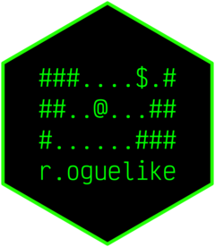

# {r.oguelike} 

<!-- badges: start -->

[](https://www.repostatus.org/#concept)
[](https://github.com/matt-dray/r.oguelike/actions)
[](https://app.codecov.io/gh/matt-dray/r.oguelike?branch=main)
[](https://mybinder.org/v2/gh/matt-dray/play-r.oguelike/main?urlpath=rstudio)
[](https://www.rostrum.blog/tags/r.oguelike/)

<!-- badges: end -->

A tile-based [roguelike toy](https://en.wikipedia.org/wiki/Roguelike) for R's console.

This is a proof-of-concept. Read more [in the blogposts](https://www.rostrum.blog/tags/r.oguelike/). Suggest improvements or fixes in [the issues](https://github.com/matt-dray/r.oguelike/issues).

You can install {r.oguelike} from GitHub via [{remotes}](https://CRAN.R-project.org/package=remotes) (CRAN packages [{crayon}](https://CRAN.R-project.org/package=crayon), [{keypress}](https://CRAN.R-project.org/package=keypress) and [{sonify}](https://CRAN.R-project.org/package=sonify) are also installed):

``` r
if (!require(remotes)) install.packages("remotes")
remotes::install_github("matt-dray/r.oguelike")
```

You could also [launch an instance of RStudio in the browser](https://mybinder.org/v2/gh/matt-dray/play-r.oguelike/main?urlpath=rstudio) with {r.oguelike} preinstalled, thanks to [Binder](https://mybinder.org/).

Use `start_game()` to begin. See `?start_game` for details on how to adjust the starting parameters.

``` r
r.oguelike::start_game(
  max_turns  = 25,
  iterations = 3,
  n_row      = 15,
  n_col      = 20,
  n_rooms    = 4
)
```

The console will clear and then you’ll see a dungeon map, an inventory bar, a status message and a prompt for player input. Output will appear in colour if your console supports it.

```
# # # # # # # # # # # # # # # # # # # # 
# # # # # # # . . . . . . . . # # # # # 
# # # # # # . . . . . . $ . . # # # # # 
# # # . . . . . . # # . . . . # # # # # 
# . . . # # # # # # # . . . # # # # # # 
# . . # # # # # # # # . . . # # # # # # 
# . . . # # # # # # # . . . . . # . # # 
# . . # # # # # # # . . . . . . . . # # 
# . . # # # # # # # # . . . . . . # # # 
# . @ . . . # # . # # # # . . . . . # # 
# . . . . . . . . . . . . . . . . # # # 
# . . . . . . . . . E . # # . . . # # # 
# . . a . . . . . . . . . . . . # # # # 
# # . . . . # # . # # # # . # # # # # # 
# # # # # # # # # # # # # # # # # # # # 
T: 25 | HP: 10 | $: 0 | a: 0
Press W, A, S or D then Enter to move, 1 to eat apple, 0 to exit
Input:
```

The dungeon map (`#` for walls and `.` for floor tiles) is [procedurally-generated](https://www.rostrum.blog/2022/05/01/dungeon/) and the placement of objects (`@` is the player, `E` is an enemy, `$` is gold and `a` is an apple) is randomised.

To move the player character (`@`), type one of [<kbd>W</kbd><kbd>A</kbd><kbd>S</kbd><kbd>D</kbd>](https://en.wikipedia.org/wiki/Arrow_keys#WASD_keys) at the prompt and hit <kbd>Enter</kbd>. If your terminal supports [{keypress}](https://github.com/gaborcsardi/keypress) (RStudio doesn't) then you'll be able to type a single arrow key instead.

After instructing the player character to move down, for example, the screen refreshes to show `@` is in a new location and the status message has been updated. Simple sound effects will play depending on the outcome of the move.

```
# # # # # # # # # # # # # # # # # # # # 
# # # # # # # . . . . . . . . # # # # # 
# # # # # # . . . . . . $ . . # # # # # 
# # # . . . . . . # # . . . . # # # # # 
# . . . # # # # # # # . . . # # # # # # 
# . . # # # # # # # # . . . # # # # # # 
# . . . # # # # # # # . . . . . # . # # 
# . . # # # # # # # . . . . . . . . # # 
# . . # # # # # # # # . . . . . . # # # 
# . . . . . # # . # # # # . . . . . # # 
# . @ . . . . . . . . . . . . . . # # # 
# . . . . . . . . E . . # # . . . # # # 
# . . a . . . . . . . . . . . . # # # # 
# # . . . . # # . # # # # . # # # # # # 
# # # # # # # # # # # # # # # # # # # # 
T: 24 | HP: 10 | $: 0 | a: 0
Moved down
Input:
```

Also note that the enemy's (`E`) position has changed and it's [heading in your direction...](https://www.rostrum.blog/2022/06/10/basic-search/)

What now? Collect the gold (`$`). Auto-battle the chasing enemy (`E`). Collect an apple (`a`) for your inventory, then eat it with a keypress input of `1` to replenish health. You’ll die if you run out of `HP` or if you reach the maximum number of turns allowed (`T`). You can quit the game with `0`.

## Code of Conduct

Please note that the {r.oguelike} project is released with a [Contributor Code of Conduct](https://contributor-covenant.org/version/2/0/CODE_OF_CONDUCT.html). By contributing to this project, you agree to abide by its terms.
